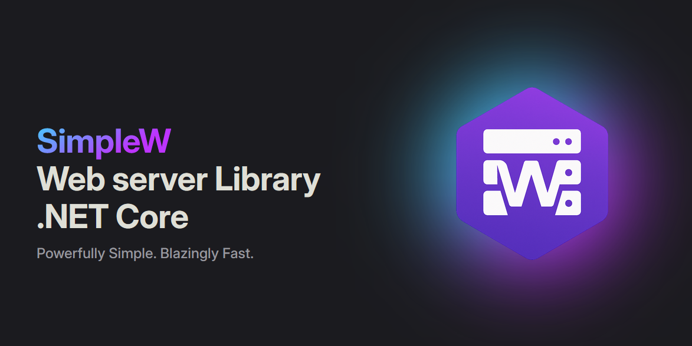

# SimpleW

 

### Features

1. Routing
2. API REST (Controller/Method + automatic json serialization/deserialization)
3. Json Web Token
4. Websocket
5. Server Sent Events
6. Static Files
7. OpenTelemetry

## Documentation

To check out docs, visit [stratdev3.github.io](https://stratdev3.github.io/SimpleW).

## Changelog

Detailed changes for each release are documented in the [CHANGELOG](https://github.com/stratdev3/SimpleW/blob/master/release.md).

## Contribution

Feel free to report issue.

## License
This library is under the MIT License.